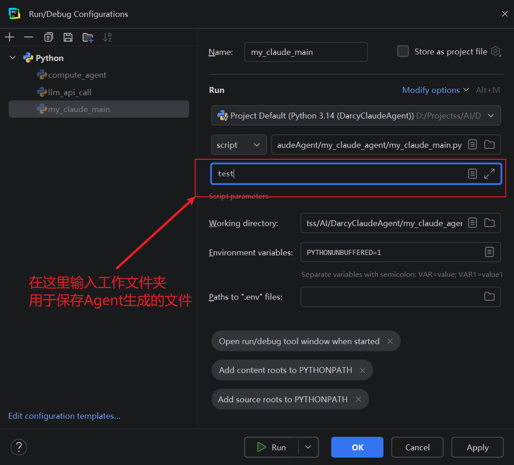
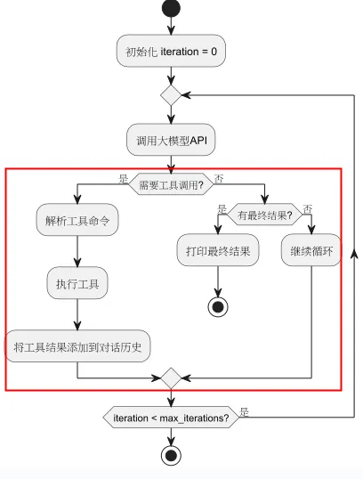

## 是什么
Python 语言实现的 ReAct模式 Agent
1. [计算器 Agent](compute_agent/compute_agent.py) 是一个简单的计算器Agent
2. [Darcy Claude Agent](claude_agent/my_claude_agent.py) 是从0到1仿写的 Claude Agent

## 有什么能力
1. llm_api_call、compute_agent、my_claude_agent 都支持 deepseek AI聊天 
2. compute_agent 拓展能力：计算乘法和除法
3. my_claude_agent 拓展能力：
   - 读文件
   - 写文件
   - 执行shell命令
   基于React模式 + 以上能力，可以完成各种任务，比如：生成贪吃蛇有戏的 web 代码。

## 怎么用
### 调用大模型api
1. 定义环境变量 DEEPSEEK_API_KEY 
2. 运行 llm_api_call/llm_api_call.py 

### 运行 compute_agent
1. 定义环境变量 DEEPSEEK_API_KEY 
2. 运行 compute_agent/compute_agent.py 

#### 运行 my_claude_agent
1. 定义环境变量 DEEPSEEK_API_KEY 
2. 运行  my_claude_agent/my_claude_agent.py
3. 这里需要先设置代码生成的目录，比如 test
   
4. 在命令行 输入问题，例如： 写一个贪吃蛇游戏，使用HTML，css和js实现，代码分别放在不同的文件中。
5. 执行shell命令时 需要输入 y

## ReAct模式
1. 借鉴人类的思维模式
作者有一个重要的洞察：我们人类在处理任务的时候有一个内心小剧场（Inner Speech），用语言的方式（Verbal Reasoning）指导我们已经做了什么（Working Memory），以及下一步要做什么。如果这个模式适用于人类，那么也会同样适用于LLM。

2. React模式
把ReAct这个思维模式进行结构化，实际上就是Thought（思考） -> Action（行动） -> Observation（观察）三步的循环：

- Thought：模型分析当前情况，思考下一步该做什么，以及为什么要这么做。
- Action：基于思考，模型决定调用哪个工具，并生成具体的调用指令（如搜索查询）。
- Observation：工具执行后返回结果（如搜索引擎返回的摘要），模型接收这个结果作为新的信息。
循环这三个步骤，每一轮，大模型都会结合Thought，Action，及Observation，进行下一轮的规划思考，直到用户任务得到最终解决。从而实现AI Agent（智能代理）。

3. 流程图

## 参考文章
1. [REACT: SYNERGIZING REASONING AND ACTING IN LANGUAGE MODELS](https://arxiv.org/abs/2210.03629)
2. [马克的技术工坊 Github](https://github.com/MarkTechStation/VideoCode)
3. [一文搞懂Agent从手搓Claude开始](https://mp.weixin.qq.com/s/ht7OqgTLhZo1hZpusVUp8Q)